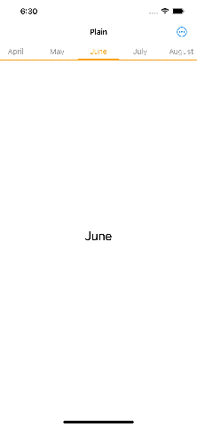
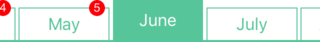

# PageMenuKitSwiftUI

PageMenuKitSwiftUI is a swift package derived from [PageMenuKitSwift](https://github.com/magickworx/PageMenuKitSwift) framework.
PageMenuKitSwiftUI has been improved to be easier and more convenient to use than PageMenuKitSwift.



You can add this package on Xcode.
See [documentation](https://developer.apple.com/documentation/swift_packages/adding_package_dependencies_to_your_app).

## How to Use

First, import PageMenuKitSwiftUI to use this package.
Then, create a menu according to the `PMKMenu` protocol as follows.

```swift
enum MonthMenu: Int, PMKMenu
{
  case january
  case february
  case march
  case april
  case may
  case june
  case july
  case august
  case september
  case october
  case november
  case december

  var index: Int { // MARK: - Required
    return rawValue
  }

  var title: String { // MARK: - Required
    switch self {
      case .january:   return "January"
      case .february:  return "February"
      case .march:     return "March"
      case .april:     return "April"
      case .may:       return "May"
      case .june:      return "June"
      case .july:      return "July"
      case .august:    return "August"
      case .september: return "September"
      case .october:   return "October"
      case .november:  return "November"
      case .december:  return "December"
    }
  }
}
```

Next, pass to `PageMenuStack` the menu you have created, the style of menu you wish to use, and the starting menu information.

Final, you implement the menu content view for each menu you created.

```swift
struct ContentView: View
{
  var body: some View {
    PMKPageMenuStack(MonthMenu.allCases, style: .plain, selected: .june) {
      (menu) -> MenuContentView in
      MenuContentView(menu: menu)
    }
  }

  struct MenuContentView: View
  {
    let menu: MonthMenu

    var body: some View {
      GeometryReader { geometry in
        ZStack {
          Rectangle()
            .foregroundColor(.white)
            .frame(width: geometry.size.width, height: geometry.size.height)
          Text(menu.title)
            .font(.title)
        }
      }
    }
  }
}
```


## Available Menu Styles

### .plain
The menu style like [ニュースパス](https://itunes.apple.com/jp/app/id1106788059?mt=8) app.


### .tab
The menu style like [グノシー](https://itunes.apple.com/jp/app/id590384791?mt=8) app.


### .smart
The menu style like [SmartNews](https://itunes.apple.com/jp/app/id579581125?mt=8) app.


### .hacka
The menu style like [ハッカドール](https://itunes.apple.com/jp/app/id888231424?mt=8) app.



### .ellipse
The menu style like [JCnews](https://itunes.apple.com/jp/app/id1024341813?mt=8) app.


### .web
The menu style like [JCnews Web Site](https://jcnews.tokyo/).


### .suite
The menu style like [NewsSuite](https://itunes.apple.com/jp/app/id1176431318?mt=8) app (the background is gradient colors).


### .netlab
The menu style like [ねとらぼ](https://itunes.apple.com/jp/app/id949325541?mt=8) app (the background is transparent).


### .nhk
The menu style like [NHK ニュース・防災](https://itunes.apple.com/jp/app/id1121104608?mt=8) app.


## Customize Style Colors

PageMenuKitSwiftUI provides `PMKColorConfiguration` to change colors for each menu style.


### .plain, .hacka, .ellipse, .nhk 

The `.plain`, `.hacka`, `.ellipse` and `.nhk ` style can set only `tintColor` using the custom initializer which is as follows.

#### .plain

The initializer is `.plain` and the argument is tintColor.
The tintColor affects the color of selected title and border.


```swift
let configuration: PMKColorConfiguration = .plain(tintColor: .purple)
var body: some View {
  PMKPageMenuStack(MonthMenu.allCases, style: .plain, selected: .june, configuration: configuration) {
    (menu) -> MenuContentView in
    MenuContentView(menu: menu)
  }
}
```

#### .hacka

The initializer is `.hacka` and the argument is tintColor.
The tintColor affects the color of title, border and selected item background.


```swift
let configuration: PMKColorConfiguration = .hacka(tintColor: .purple)
var body: some View {
  PMKPageMenuStack(MonthMenu.allCases, style: .hacka, selected: .june, configuration: configuration) {
    (menu) -> MenuContentView in
    MenuContentView(menu: menu)
  }
}
```

#### .ellipse

The initializer is `.ellipse` and the argument is tintColor.
The tintColor affects the color of selected title and unselected item background.


```swift
let configuration: PMKColorConfiguration = .ellipse(tintColor: .purple)
var body: some View {
  PMKPageMenuStack(MonthMenu.allCases, style: .ellipse, selected: .june, configuration: configuration) {
    (menu) -> MenuContentView in
    MenuContentView(menu: menu)
  }
}
```

#### .nhk

The initializer is `.nhk` and the argument is tintColor.
The tintColor affects the color of title, border and selected item background.


```swift
let configuration: PMKColorConfiguration = .nhk(tintColor: .purple)
var body: some View {
  PMKPageMenuStack(MonthMenu.allCases, style: .nhk, selected: .june, configuration: configuration) {
    (menu) -> MenuContentView in
    MenuContentView(menu: menu)
  }
}
```


### .tab, .smart

The `.tab`, and `.smart ` style can set only `menuColors` using the custom initializer which is as follows.

#### .tab

The initializer is `.tab` and the argument is menuColors.
The menuColors affects the color of the title. The border color is applied by the color of the selected item. 
If the number of menus is greater than the number of color schemes, the colors are applied in order.


```swift
let configuration: PMKColorConfiguration = .tab(menuColors: [ .red, .orange, .green, .blue, .purple ])
var body: some View {
  PMKPageMenuStack(MonthMenu.allCases, style: .tab, selected: .june, configuration: configuration) {
    (menu) -> MenuContentView in
    MenuContentView(menu: menu)
  }
}
```

#### .smart

The initializer is `.smart` and the argument is menuColors.
The menuColors affects the color of the item background. The border color is applied by the color of the selected item. 
If the number of menus is greater than the number of color schemes, the colors are applied in order.


```swift
let configuration: PMKColorConfiguration = .smart(menuColors: [ .red, .orange, .yellow, .green, .purple ])
var body: some View {
  PMKPageMenuStack(MonthMenu.allCases, style: .smart, selected: .june, configuration: configuration) {
    (menu) -> MenuContentView in
    MenuContentView(menu: menu)
  }
}
```


### .web

The initializer is `.web` and the arguments are `tintColor`, `borderColor` and `inactiveBackgroundColor`.
The tintColor affects the color of the selected item background.
The borderColor affects the color of bottom border.
The inactiveBackgroundColor affects the unselected item background.


```swift
let configuration: PMKColorConfiguration = .web(tintColor: .purple, borderColor: .red, inactiveBackgroundColor: .teal)
var body: some View {
  PMKPageMenuStack(MonthMenu.allCases, style: .web, selected: .june, configuration: configuration) {
    (menu) -> MenuContentView in
    MenuContentView(menu: menu)
  }
}
```


### .suite

The initializer is `.suite` and the arguments are `tintColor` and `gradient`.
The tintColor affects the bottom border color of the selected item.
The gradient affects the item background.


```swift
let configuration: PMKColorConfiguration = .suite(tintColor: .purple, gradient: [.orange, .pink])
var body: some View {
  PMKPageMenuStack(MonthMenu.allCases, style: .suite, selected: .june, configuration: configuration) {
    (menu) -> MenuContentView in
    MenuContentView(menu: menu)
  }
}
```


### .netlab

The initializer is `.netlab` and the arguments are `tintColor` and `activeBackgroundColor`.
The tintColor affects the title color of the unselected items.
The activeBackgroundColor affects the color of selected item background.


```swift
let configuration: PMKColorConfiguration = .netlab(tintColor: .green, activeBackgroundColor: .mint)
var body: some View {
  PMKPageMenuStack(MonthMenu.allCases, style: .netlab, selected: .june, configuration: configuration) {
    (menu) -> MenuContentView in
    MenuContentView(menu: menu)
  }
}
```

## Appendixes

### PMKMenu Protocol

```swift
protocol PMKMenu: CaseIterable, Hashable
{
  var index: Int { get }
  var title: String { get }
}
```

### PMKColorConfiguration Initializers

```swift
static func plain(tintColor: Color) -> Self

static func hacka(tintColor: Color) -> Self

static func ellipse(tintColor: Color) -> Self

static func nhk(tintColor: Color) -> Self

static func tab(menuColors: [Color]) -> Self

static func smart(menuColors: [Color]) -> Self

static func netlab(tintColor: Color, activeBackgroundColor: Color) -> Self

static func suite(tintColor: Color, gradient: [Color]) -> Self

static func web(tintColor: Color, borderColor: Color, inactiveBackgroundColor: Color) -> Self
```


### PMKPageMenuStack View

```swift
struct PMKPageMenuStack<Menu,Content>: View where Menu: PMKMenu, Content: View
```

```swift
init(_ menus: [Menu], style: PMKMenuStyle, selected: Menu, configuration: PMKColorConfiguration? = nil, @ViewBuilder content: @escaping (Menu) -> Content)
```

## Requirements

 - Swift 5 or later
 - iOS 15 or later
 - Xcode 13.4 or later

## License

This package is licensed under [BSD License](LICENSE)
